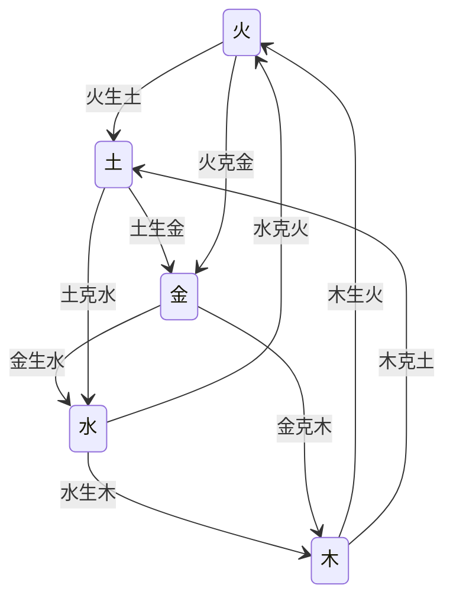

# 第1章 中医学的哲学基础

气一元论、阴阳学说、五行学说，属于中国古代哲学的范畴，是用以认识和解释物质世界发生、发展和变化规律的宇宙观，是构建中医学理论体系的基石。

春秋战国至秦汉时期，“诸子蜂起，百家争鸣”，中国古代哲学得以长足发展，气一元论、阴阳学说、五行学说，盛行于天文、地理、历法、政治、经济、兵法、农业等自然科学和社会科学等领域，并且对中医学理论体系的形成产生深刻的影响。

中医学运用气一元论、阴阳学说、五行学说关于宇宙物质性和运动变化的思维模式，归纳总结医学知识及临床实践经验，构建中医学独特的理论体系，从而认识人类生命的发生，阐释人体形态结构及功能活动，辨析疾病发生的原因和机理，制定养生和诊治的规律和原则。

## 第一节　气一元论

气是中国古代哲学的最高范畴。古代哲学家认为，气是存在于宇宙之中的无形而运动不息的极细微物质，是宇宙万物的共同构成本原，由此形成“气一元论”的思想。

一　气的哲学概念与气一元论

气一元论，简称“气论”，是古人认识和阐释物质世界的构成及其运动变化规律的宇宙观。古人在长期的生活实践和观察认识自然的过程中，抽象概括出了气的概念，并赋予其丰富的内涵，用于说明宇宙的本体、万物的起源与演化和各种自然现象，建立了以气为本原的宇宙观。

（一）气概念的形成

“气”字早在甲骨文中就已出现，最初是表示具体事物的概念。《说文解字》说：“气，云气也，象形。”“气”指云气，是一种可见的客观实在。古人通过对自然界的云气、雾气、风气、冷暖之气，生活中的烟气、蒸气、水气和人体的呼吸之气等客观现象的观察与思考，逐渐产生了气是一种客观存在、万物皆有气的认识。

春秋战国时期，气作为哲学概念逐渐形成。气是存在于宇宙之中的无形而运动不息的极细微物质。气精细无形无象，微不易察，但却是客观的实在。《管子》认为“精”是极其精微的气，所以叫“精气”。气无形而生有形，是构成万物之本原，无处不在，无所不有，充满整个空间。宇宙间包括生命在内的天地万物都是由气生成，“其大无外，其小无内”（《管子·内业》）。大至整个宇宙，也可以是最微小的物质。在天成为列星，在地生成五谷，天地之精气合而为人。

气以不同物质形式存在。气处于弥散而运动状态，充塞于无垠的宇宙空间，至精无形，细不易察，故称其“无形”；气处于凝聚的状态，形成各种事物，有着具体形状，即《素问·六节藏象论》所谓“气合而有形”。有形和无形是气的聚合和弥散的不同状态，无形之气凝聚而成有质之形，形消质散又复归于无形之气。以气为本原，自然界“无形之物”与“有形之体”之间处于不断的转化之中。

（二）气的哲学概念

中国古代哲学关于气的基本概念：气是一种极其细微的物质，是构成世界的物质本原。气作为中国古代哲学的最高范畴，其本义是客观的、具有运动性的物质存在；其泛义是世界的一切事物或现象，包括精神现象，均可称之为气。

气是宇宙本体和万物之原，人们用气来解释各种现象。如《管子·心术下》所说：“一气能变曰精”“精也者，气之精者也”（《管子·内业》）。精或精气是极其精微的、能够运动变化的气。气充塞于天地之间，是化生自然万物的基本物质，人的形体及精神智慧也是精气的产物，如《易传·系辞上》：“精气为物，游魂为变。”表明精气化生和构成万物的观点。庄子提出万物皆为一气之变化，提出“通天下一气耳”，并以气之聚散说明人的生死，“人之生也，气之聚也，聚则为生，散则为死”（《庄子·知北游》）。气在这里成为万物统一的基础，万物的存亡、生命的起源和本质不外乎气之聚散。先秦儒家孟子提出“浩然之气”的概念，认为“气”兼有生命与道德、物质与精神的特点。

《素问·气交变大论》说：“善言气者，必彰于物。”气与物是一个统一体，由于其极其细微，故谓之“无形”，但并非气不存在，只不过肉眼难辨而已。气的存在，可通过其运动变化及其产生的物质而表现出来。《素问·六节藏象论》说：“气合而有形，因变以正名。”由于气的运动变化，产生世界多种多样的有形物质，因而命名为不同的名称。

（三）气一元论

气一元论，是研究气的内涵及其运动，并用以阐释宇宙万物的构成本原及其发展变化的古代哲学思想。

精气学说是气一元论的早期概念。精的概念，首见于《老子·二十一章》：“道之为物……窈兮冥兮，其中有精；其精甚真，其中有信。”所谓道，即气，气是物质，精是气的精华。精、精气、气的内涵基本相同。精气学说以气（精气）为世界万物的本原，是宇宙万物生成的共同物质基础，形成了气一元论的雏形。《管子》《易传·系辞上》《吕氏春秋》《淮南子》及《论衡》也有精或精气的记叙。成书于这一时期的中医学经典著作《内经》，正是精气学说风靡社会科学、自然科学领域的时代，因此，中医学理论体系至今仍然或多或少地保留着精气学说的思想。

两汉时期，“元气”为万物本原的思想兴起，精气学说逐渐为元气学说所同化。如东汉时期著名哲学家王充的“元气学说”，将化生天地万物本原的气称之为“元气”，认为“元气未分，混沌为一”“天地，合气之自然也”（《论衡·谈天》），“天地合气，万物自生”（《论衡·自然》）。同时代的中医学著作《难经》受到古代哲学的影响，第一次使用“原（元）气”的概念，以此为人之生命的根本。

后世关于气的学说得到进一步发展，如宋·张载《正蒙》等著作，提出“太虚即气”的学说，肯定气是构成万物的实体，气的聚散变化，形成各种事物和现象。明清之际，方以智、顾炎武、王夫之和戴震等思想家进一步发展气一元论，使气成为中国古代哲学的最高范畴。

中医学理论体系的奠基之作《内经》汲取了气一元论思想，把气看作宇宙的本原，天地万物皆以气为始基。气的聚合变化产生有形的万物，人亦不例外，《素问·宝命全形论》说：“天地合气，命之曰人。”以气说明生命的本质，以气的运动变化阐释人体生命活动以及疾病的发生和诊断治疗，从而构建中医学气的理论。其后，历代医家言必称气，如李东垣论“胃气”，汪机论“营卫之气”，喻昌论“大气”，吴又可论“戾气”，黄元御论“中气”等，使气的理论不断发展，广泛应用于中医学理论体系的基础研究和临床实践。

二　气一元论的基本内容

（一）气是物质

气，最基本的特性就是物质性。充满宇宙间的气，是构成万物的基本物质。《易传·系辞上》说：“精气为物。”天地山川、人禽草木、日月水火都是由物质的气构成。如王充认为，宇宙是一个物质性的实体，是由物质性的元气所构成，“万物之生，皆禀元气”（《论衡·言毒》）；人也是由元气构成，如《论衡·自然》：“天地合气，万物自生，犹夫妇合气，子自生矣。”人的生命和精神也以“气”为物质基础，“人未生，在元气之中；既死，复归元气”（《论衡·论死》）。

（二）气是万物的本原

气一元论认为，气是构成天地万物包括人类的共同原始物质。宇宙中的一切事物和现象，都是由气构成，气的运动推动着宇宙万物的发生发展和变化。

气是构成天地万物的本原。如《公羊传解诂·隐公元年》：“元者，气也。无形以起，有形以分，造起天地，天地之始也。”说明元气为天地万物的本原。

《庄子·至乐》：“气变而有形，形变而有生。”故曰“通天下一气耳”（《庄子·知北游》）。气一元论经历最初对自然现象的客观描述，逐渐演变发展成为一种自然观，在古代哲学中占据主要地位。

天地精气化生为人。人与万物同源于气，但人类与宇宙中的他物不同，不仅有生命，还有精神活动，是由“精气”，即气中的精粹部分所化生。如《管子·内业》：“人之生也，天出其精，地出其形，合此以为人。”《淮南子·精神训》：“烦气为虫，精气为人。”气也是维持生命活动的基本物质。《素问·六节藏象论》说：“五气入鼻，藏于心肺，上使五色修明，音声能彰。五味入口，藏于肠胃，味有所藏，以养五气，气和而生，津液相成，神乃自生。”天食人以五气，地食人以五味，设或人体一刻无气、七日绝谷，则生命危殆。

（三）气的运动是万物变化的根源

气的运动是物质世界存在的基本形式，“气坱然太虚，升降飞扬，未尝止息……为风雨，为雪霜，万品之流形，山川之融结，糟粕煨烬”（《正蒙·太和》）。天地万物生灭终始皆是气之升降聚散运动的表现。气不断运动变化形成自然界一切事物的纷繁变化生生不息。

气的运动，称为气机。运动不息，流行不止，变化无穷，是气的基本特性之一。升、降、出、入、聚、散是气运动的基本形式。升与降、出与入、聚与散，既相互对立，又保持着协调平衡关系。如《素问·六微旨大论》说：“升降出入，无器不有。”“出入废，则神机化灭；升降息，则气立孤危。故非出入，则无以生、长、壮、老、已；非升降，则无以生、长、化、收、藏。”聚与散也是气的运动形式，宋·张载认为：“太虚不能无气，气不能不聚为万物，万物不能不散而为太虚”（《正蒙·太和》）。古人以气的聚散运动说明天地的形成。万物的变化，人的生死也是气聚散运动的结果。

气的变化，称为气化。气的运动是宇宙产生各种变化的动力。万物以气为本原，万物的生长衰亡、形态变化、盈亏虚实，皆是气化的结果。张载《正蒙·太和》说：“由太虚，有天之名；由气化，有道之名。”太虚即气，道即气化。气化其小无内，其大无外，天地万物的变化及其规律皆由气化。与“气化”相对，有“形化”，指气化而生万物之后，各物种的形体遗传。《二程遗书·第五》说：“万物之始皆气化；既形然后以形相禅，有形化。”世界万物所发生的一切变化都是气化的结果，由气化产生形体，形体又可复归于气。

（四）气是天地万物相互联系的中介

气是天地万物的共同本原，天地万物之间又充斥着无形之气，无形之气与有形实体进行着各种形式的交换活动，因而成为天地万物相互联系、相互作用的中介物质。

气是事物之间相互感应、传递信息的中介。感应，指事物之间的相互交感、相互影响、相互作用。同类事物之间存在着“类同则召，气同则合，声比则应”（《吕氏春秋·应同》），具有相互感应的联系，如乐器共振共鸣、磁石吸铁、日月吸引海水形成潮汐，皆属于自然感应现象。事物之间相互感应是通过气作为传递信息的中介而实现。由于形由气化，气充形间，气能感物，物感则应，故事物之间不论距离远近，皆能通过信息传递而相互感应。人处于天地气交之中，通过气与天地万物的变化息息相通，即所谓“生气通天”，日月、昼夜、季节气候变化对人的生理与病理过程具有重要影响，也正是通过气的中介作用，使人与天地息息相应。

总之，气一元论认为，气是宇宙的本体，构成万物的本原，维系着天地万物之间的相互联系，气的运动变化推动宇宙万物的发生发展和变化。

三　气一元论在中医学中的运用

气一元论渗透融汇到中医学，作为重要的认识论和思维方法，构建了人体之气的理论，用以阐释人的生命活动，形成健康观念和养生之道，并指导疾病的诊断与防治。

（一）构建天人合一整体观

基于中国古代哲学的气一元论，中医学认为，人是自然的产物，“天地合气，命之曰人”（《素问·宝命全形论》）；人是万物之灵，“天覆地载，万物悉备，莫贵于人”（《素问·宝命全形论》）。中医学崇尚“生命至重，惟人最尊”的道德信念，以人为本，尊重生命，珍爱生命；以“气”为中介将人与天地联系起来，天、地、人均本原于气而相参相应，如《灵枢·岁露论》认为：“人与天地相参也，与日月相应也。”中医学运用气一元论的思想，从自然环境、社会环境、时间、空间等综合因素研究人的生命与健康，指导疾病的诊断、防治与康复等，从而构建中医学天人合一的整体观。

（二）阐释人体生命活动

中医学从气是宇宙的本原，是构成天地万物基本要素的观点出发，认为气是生命的本原，是构成生命的基本物质，如《灵枢·天年》所说：“人之始生，何气筑为基？何立而为楯……以母为基，以父为楯。”人的生命来源于父母之精气，谓之“先天之气”；维持人体生命活动的各种物质，皆包含在气的范畴中，如《灵枢·决气》所说：“人有精、气、津、液、血、脉，余意以为一气耳。”气的运动是生命活动的根本，气化是生命活动的基本形式。自然界天地之气的变化、精气血津液等生命物质的新陈代谢以及相应的能量与信息转化、生长壮老已的生命过程等，都是气运动变化的体现。气的运动变化停止，则意味着生命的终止。

（三）解释人体疾病变化

中医学将各种致病因素，称为“邪气”。《素问·举痛论》说：“百病生于气也。”自然界气候的异常变化或人体抗病能力下降时，邪气则侵袭人体，称为“六淫”之气；具有强烈传染性和致病性的邪气，称为“疠气”，为引起疾病的外感病因。情志内伤、饮食劳逸所伤等，为内伤病因，导致脏腑阴阳气血功能失常。人体之气的失常变化多端，可因气的生成不足发为气虚；也可因气的升降出入运动失常而为气机失调，发为气滞、气逆、气陷、气闭、气脱等。

（四）指导疾病的诊治

内在脏腑的功能正常与否，其信息可以气为载体，以经络为通道反映于体表相应的部位，如“心气通于舌”“肝气通于目”“脾气通于口”“肺气通于鼻”“肾气通于耳”等。脏腑之气盛衰及其功能强弱的常变，皆可通过气的介导而反映于体表。因此，中医学通过望闻问切四诊，审神色声音，观五官九窍，察五脏病形，以判断人体之气的运行及虚实状态。气的运动失常是人体疾病的基本病机，故调理气机是中医学主要的治疗法则之一。特别是针刺、艾灸和按摩等适宜治疗技术，更是以“得气”“行气”为法，通过激发经络之气，感应传导信息，以达到疏通经络、调整脏腑功能的治疗目的。

## 第二节　阴阳学说

阴阳学说，属于中国古代哲学理论范畴，阴阳的对立统一是天地万物运动变化的根本规律。中医学以阴阳交感、对立、互根、消长、转化及自和规律，认识和说明生命、健康和疾病。

阴阳学说是古人用以认识自然和解释自然变化的自然观和方法论。世界是物质的，物质世界本身是阴阳二气对立统一的结果。阴阳二气的相互作用及其运动变化，形成了事物的发生并推动着事物的发展和变化。

阴阳学说融入中医学理论体系，广泛应用于阐释人体的生命活动，分析疾病的发生、发展和变化的机理，并指导着疾病的诊断和防治，成为中医学理论体系的哲学基础，对中医学理论体系的发展产生了极为重要的影响。

一　阴阳的概念与归类

（一）阴阳概念的形成

阴阳的概念起源于远古时期。人类对自身及自然现象的观察，特别是对人类生活、生产影响最大的太阳出没、月亮变化等明暗交替的天象观察，由此形成阴阳最初含义，即向日为阳，背日为阴。阴阳最早的文字记载见于殷商时期的甲骨文，有“阳日”“晦月”等字样。在甲骨文中，阴阳所指为日、月。《说文解字》说：“阴，暗也。”“阳，高明也。”朝向日光、明亮者为阳；背向日光、晦暗者为阴。随着对自然现象的观察不断扩展，阴阳的含义逐渐引申，如天地、上下、明暗、寒热、动静等。

春秋战国时期，阴阳学说作为哲学思想逐渐形成。古代哲学家用具有对立统一、辩证思维的阴阳学说解释自然现象、社会政治及伦理道德等。如《国语·周语》记载周幽王二年（前780年）伯阳父以“阳伏而不能出，阴迫而不能烝”，解释陕西发生的大地震。《老子·四十二章》说：“万物负阴而抱阳，冲气以为和。”认为阴阳相互作用所产生的冲和之气是推动事物发生发展变化的根源。

《周易》分别用符号“--”“—”来表示阴阳，提出“一阴一阳之谓道”的命题，把阴阳学说提升到哲学高度进行概括，将阴阳的对立属性及其运动变化视为宇宙万物的本性及变化的基本规律。《周易》把自然、社会中诸如天地、日月、寒暑、动静、刚柔、进退、水火、男女等具有对立关系的事物或现象，都赋予阴阳的属性，使阴阳成为对立统一的哲学范畴。

春秋战国时期，阴阳观念应用到医学领域。秦名医医和在为晋侯诊病时，以阴阳解释疾病的病因，“天有六气，降生五味，发为五色，徵为五声，淫生六疾。六气曰阴、阳、风、雨、晦、明也……阴淫寒疾，阳淫热疾”（《左传·昭公元年》）。成书于战国至秦汉之际的《内经》，阴阳学说贯穿其理论始终。如“自古通天者，生之本，本于阴阳”，说明人与自然界的关系；“阴平阳秘，精神乃治。阴阳离决，精气乃绝”，解释人体的生理和病变；“谨察阴阳所在而调之，以平为期”，用以指导诊断和治疗。

大约在10世纪以后，阴阳逐渐采用“太极图”（图1-1）表示。太极是中国古代哲学术语，意为派生万物的本原。太极图以黑白两个鱼形纹组成的圆形图案，形象化表示阴阳交感、对立、互根、消长、转化的关系，体现出一切事物或现象具有辩证、运动、圆融的特征和规律。

图1-1　太极图

（二）阴阳的基本概念

阴阳概念的形成，是从天地日月、四时寒暑、昼夜阴晴等自然现象的观察，抽象而形成中国古代哲学的世界观与认识论，一气分阴阳，阴阳对立互根是一切事物所存在的固有属性，阴阳二气的运动是事物发生、发展、变化，乃至消亡的内在动力。如《类经·阴阳类》所说：“道者，阴阳之理也。阴阳者，一分为二也。”

阴阳的概念，属于中国古代哲学范畴，是对相关事物或一事物本身存在的对立双方属性的概括，既可表示相关联又相对应的两种事物或现象的属性划分及运动变化，又可表示同一事物内部相互对应着的两个方面的属性趋向及运动规律。（《中华医学百科全书·中医基础理论》）

中医学关于阴阳基本概念的经典表述，见于《素问·阴阳应象大论》：“阴阳者，天地之道也，万物之纲纪，变化之父母，生杀之本始，神明之府也。”阴阳是自然界的法则和规律，世界万物运动变化的纲领和根本，贯穿事物新生消亡的始终，是事物发生、发展和变化的内在动力。应用阴阳学说分析事物和现象，凡是具有对立相反又相互关联的事物和现象或同一事物内相互对立的两个方面，都可用阴阳来概括。如以天地而言，则天为阳，地为阴；以人而言，则男为阳，女为阴；以气血而言，则气为阳，血为阴等。

（三）阴阳的特性与归类

1　阴阳的特性

(1)阴阳的普遍性　阴阳学说认为，世界上很多事物和现象都存在正反两个方面，皆可用阴阳来标示。阴阳，既可以标示相互对立的两种事物或现象，又可以标示同一事物或现象内部对立的两个方面。阴阳可概括天地，包罗万象。如天阳地阴，日阳月阴，夏阳冬阴，火阳水阴，男阳女阴等。宇宙万物的发生发展变化及相互关系都可以纳入阴阳范畴。中医学认为“人生有形，不离阴阳”（《素问·宝命全形论》）。人体组织结构、生理功能、病机变化以及诊断治疗皆可用阴阳概括说明。

(2)阴阳的关联性　阴阳所概括的一对事物或现象应是共处于统一体中，或一事物内部对立的两个方面，如空间的上与下、内与外，时间的春夏与秋冬、昼与夜，温度的寒与热，生命物质的气与血等，都是既相对立又相互关联的两个方面，可用阴阳标示。若不是在一个统一体中，无关联性的事物或现象，如寒与上、昼与外等，则不能用阴阳概括说明。

(3)阴阳的规定性　阴阳学说对阴阳各自属性有着明确的规定，具有不可变性和不可反称性。如光明、温暖、向上、趋外、兴奋、发散等，是阳的特性；晦暗、寒冷、向下、内收、沉静、凝聚等，是阴的特性。用阴阳说明事物的属性，如水属阴、火属阳。水不能称为阳，火不能反称阴。人体脏腑中心阴与心阳、肾阴与肾阳、肝阴与肝阳等，皆有其特定内涵，不可反称。

(4)阴阳的相对性　相对性指事物阴阳属性并不是一成不变的，主要表现在三个方面：

其一，阴阳属性可以互相转化。在一定条件下，事物的阴阳属性可以发生相互转化，阴可以转化为阳，阳也可以转化为阴。如寒证和热证的转化：属阴的寒证在一定条件下可以转化为属阳的热证；属阳的热证在一定条件下也可以转化为属阴的寒证。病变的寒热性质发生变化，其证候的阴阳属性也随之改变。

其二，阴阳之中复有阴阳，即阴中有阳，阳中有阴。阴阳双方的任何一方又可以再分阴阳，如昼为阳，夜为阴。白昼的上午与下午相对而言，则上午为阳中之阳，下午为阳中之阴；夜晚的前半夜与后半夜相对而言，则前半夜为阴中之阴，后半夜为阴中之阳。事物这种既相互对立而又相互联系的现象，在自然界是无穷无尽的。故《素问·阴阳离合论》说：“阴阳者，数之可十，推之可百，数之可千，推之可万。万之大，不可胜数，然其要一也。”

其三，阴阳属性随比较对象而变。事物的阴阳属性是通过对立双方比较而划分的。若比较的对象发生了改变，事物的阴阳属性可随之发生改变。如100℃与50℃的水，100℃属阳，50℃属阴；而50℃与0℃相比较，则50℃属阳，0℃属阴。人体内六腑与五脏分阴阳，六腑主传泻水谷属阳，五脏主内藏精气属阴；六腑与四肢比较，则六腑居内为阴，四肢在外为阳。可见，随着划分的前提和依据改变，事物的阴阳属性可随之变化。

2　事物阴阳属性的归类

凡是具有相互关联且又相互对立的事物或现象，或同一事物内部相互对立的两个方面，都可以用阴阳来概括分析其各自的属性。

事物的阴阳属性，依据阴阳各自的属性特征进行类比区分。凡是具有运动的、外向的、上升的、弥散的、温热的、明亮的、兴奋的等特性的事物和现象，都属于阳；相对静止的、内守的、下降的、凝聚的、寒冷的、晦暗的、抑制的等特性的事物和现象，都属于阴（表1-1）。

表1-1　事物阴阳属性归类表
| 属性 | 空间        | 时间 | 季节  | 温度 | 湿度 | 重量 | 性状 | 亮度 | 事物运动状态      |
|----|-----------|----|-----|----|----|----|----|----|-------------|
| 阴  | 上/外/左/南/天 | 昼  | 春/夏 | 温热 | 干燥 | 轻  | 清  | 明亮 | 上升/运动/兴奋/亢进 |
| 阳  | 下/内/右/北/地 | 夜  | 秋/冬 | 寒凉 | 湿润 | 重  | 浊  | 晦暗 | 下降/静止/抑制/衰退 |

水与火这一对事物具备了寒热、动静、明暗的特性，集中反映了阴阳的属性，成为事物划分阴阳属性的标志。《素问·阴阳应象大论》说：“水火者，阴阳之征兆也。”

二　阴阳学说的基本内容

阴阳学说是以阴阳的对立统一及其相互作用阐释宇宙间万物的生成、发展和变化的根本规律，其主要内容包括阴阳交感、阴阳对立、阴阳互根、阴阳消长、阴阳转化、阴阳自和等方面。

（一）阴阳交感

阴阳交感，指阴阳二气在运动中相互感应而交合的相互作用。阴阳交通相合，彼此交感相错，是宇宙万物赖以生成和变化的根源。所谓“天地感而万物化生”（《周易·咸彖》），“阴阳相错，而变由生”（《素问·天元纪大论》）。

阴阳交感是天地万物化生的基础。“清阳为天，浊阴为地”（《素问·阴阳应象大论》）。阳气升腾而为天，阴气凝聚而为地。天气下降，地气上升，天地阴阳二气相互作用，交感合和，产生万物。《易传·系辞下》说：“天地氤氲，万物化醇；男女构精，万物化生。”如自然界，天地阴阳二气交感，形成云、雾、雷电、雨露，万物得以化生。人类作为宇宙万物之一，同样由天地阴阳之气交感合和而生成，“天地合气，命之曰人”（《素问·宝命全形论》）。生命便是在天地阴阳交互作用下孕育生息。如果没有阴阳二气的交感运动，就没有自然界万物，也就没有生命。

阴阳交感是事物和现象发展变化的动力。阴和阳属性相反，两者不断相摩相荡，发生交互作用，宇宙万物才能生生不息，变化无穷。“天地合而万物生，阴阳接而变化起”（《荀子·礼论》）。自然界，正是由于天之阳气下降，地之阴气上升，阴阳不断的交互作用形成阳光雨露，沐浴滋润万物，得以成长繁茂。

（二）阴阳对立

阴阳对立，指阴阳“一分为二”，即对待、相反的关系，是事物或现象固有的属性。阴阳学说认为，对立相反是阴阳的基本属性，宇宙间很多事物和现象都存在对立相反的两个方面。如天与地、日与月、水与火、男与女、寒与热、动与静、上与下、左与右等。

阴阳对立的形式，通过阴阳之间的相互斗争、相互制约而发挥作用。阴可制约阳，阳能制约阴。所谓“阴则能制阳矣，静则能制动矣”（《管子·心术上》）。如春、夏、秋、冬四季有温、热、凉、寒的气候变化，春夏之所以温热，是因为春夏阳气上升抑制了秋冬的寒凉之气；秋冬之所以寒冷，是因为秋冬阴气上升抑制了春夏的温热之气的缘故。阴阳相互制约是自然界四时寒暑往复变化的根源。人体正常生理活动具有兴奋和抑制的两种状态，即兴奋为阳，抑制属阴，彼此相互制约。昼则阳制约阴，人处于兴奋清醒状态；夜则阴制约阳，进入安静睡眠状态。阴阳对立相反而有昼夜寤寐的不同变化，动静相制维持人体寤和寐的正常节律，充分体现了阴阳双方的相互对立、相互制约。

阴阳对立制约的意义，在于防止阴阳的任何一方不至于亢盛为害，以维持阴阳之间的协调平衡。阴阳双方始终处于矛盾运动之中，在一定的限度内，由于阴阳双方相互斗争和相互制约的作用，才能够使阴阳的任何一方既无太过，也无不及，从而实现事物或现象内部及其相互之间的动态平衡，才能生生不息。如果阴阳双方中的一方过亢，对另一方制约太过；或阴阳双方中的一方不及，不能制约对方，则阴阳之间的对立制约关系失调，彼此之间的动态平衡被破坏，则会导致疾病产生。如《素问·阴阳应象大论》所谓“阴胜则阳病，阳胜则阴病”，为“制约太过”；“阳虚则阴盛”“阴虚则阳亢”，是“制约不及”；从而形成阴阳失调的病机变化。

（三）阴阳互根

阴阳互根，指相互对立的阴阳两个方面，具有相辅相成、相互依存的关系。阴阳互根的形式，通过阴阳互藏、互为根本而发挥作用。

1　阴阳互藏

阴阳互藏，指相互对立的阴阳双方中的任何一方都包含着另一方，即阴中有阳，阳中有阴。宇宙中的任何事物都含有阴与阳两种属性不同的成分，属阳的事物含有阴性成分，属阴的事物也寓有属阳的成分。以天地而言，天为阳，地为阴。“地气上为云，天气下为雨”，天为地气升腾所形成，阳中蕴涵有阴；地乃天气下降所形成，则阴中蕴涵有阳。如《类经·运气类》说：“天本阳也，然阳中有阴；地本阴也，然阴中有阳，此阴阳互藏之道。”以人体而言，心在上，五行属火；肾在下，五行属水。心火（阳）下降于肾，以温肾阳，使肾水（阴）不寒；肾水（阴）上济于心，以滋心阴，使心火（阳）不亢，则心肾阴阳水火协调平衡。如《冯氏锦囊秘录·杂证大小合参》说：“水火互藏其根，故心能下交，肾能上摄。”

2　阴阳互根

阴阳互根，指阴阳的互为根本、相互依存的关系，即“阳根于阴，阴根于阳”。阳的根本在阴，阴的根本在阳，双方互为存在的前提。互为根本的阴阳双方具有相互资生、促进和助长的作用。

阴阳互藏互根的意义，在于阴阳始终处于统一体之中，每一方都以对方的存在作为自身存在的前提和条件，任何一方都不能脱离对方而单独存在。例如，春夏为阳，秋冬为阴，没有春夏，就无所谓秋冬；没有秋冬，就无所谓春夏。寒为阴，热为阳，没有寒，就无所谓热；反之亦然。阴不可无阳，阳不可无阴，阴阳双方密不可分。

（四）阴阳消长

阴阳消长，指阴阳双方不是静止不变的，而是处于不断的消减和增加的运动变化之中。消，减少、减退；长，增加、增长。古代哲学家认为，阴阳双方始终处于运动变化中，阴长阳消，阳长阴消。阴阳双方彼此的消减与增加的变化在一定的范围、限度、时空之内，保持着动态平衡。正是由于阴阳的消长变化，自然万物才能够维持相对、动态的平衡。

阴阳消长的形式，属于量变过程中进退、增减、盛衰的运动变化，包括此长彼消、此消彼长的阴阳互为消长与此长彼长、此消彼消的阴阳同消同长。

1　阴阳互为消长

相互对立的阴阳双方，在彼此相互制约的过程中表现出互为消长的变化。表现形式有二：一是此长彼消，指阴或阳某一方增加而另一方随之出现消减的变化，即阳长阴消，阴长阳消。二是此消彼长，是阴或阳某一方消减而另一方随之出现增加的变化，即阳消阴长，阴消阳长。由于阴阳相互制约，阳长制约阴则阴消，阴长制约阳而阳消；若阳消而对阴的制约减弱则阴长，阴消对阳制约减弱则阳长。故阴阳互为消长是阴阳对立制约关系表现出的运动变化，而阴阳相互制约又在互为消长过程中实现。

自然界四时气候及昼夜的往复变化即是阴阳消长变化的体现。如一年四季的气候变化，从冬季寒冷，至春天温暖，再到夏天暑热，气候从寒冷逐渐转暖变热，即是“阳长阴消”的过程；由夏季暑热，到秋天凉爽，再至冬季寒冷，气候由炎热逐渐转凉变寒，这是“阴长阳消”的过程。四时气候变迁，寒暑往来，反映了阴阳消长的过程。一年当中，阴阳消减和增加处于一定范围和限度，形成相对的动态平衡，则有四时寒暑交替推移、周而复始的正常规律。

以阴阳消长之理阐释人体的生理活动。子时一阳生，平旦阳气升发，日中阳气隆盛，随着阳气增长而阴气消减，人体的生理功能由抑制逐渐转向兴奋，即“阳长阴消”的过程；午时一阴生，日中至黄昏，阴气渐生，至夜半阴气盛，阳气随之渐减，人体的生理功能也由兴奋逐渐转向抑制，即“阴长阳消”的过程。人体在昼夜晨昏表现出周期性变化规律，即是由于阴阳之间互为消长，在一定范围和限度内不断进行而维持的动态平衡。

2　阴阳同消同长

相互依存的阴阳双方，在彼此相互资助和促进的过程中表现出同消同长的变化。表现形式有二：一是此长彼长，是阴阳之间出现某一方增加而另一方亦增加，即阴随阳长或阳随阴长；二是此消彼消，是阴与阳之间出现某一方消减而另一方亦消减，即阴随阳消或阳随阴消。由于阴阳相互为用，阳生可促进阴的化生；阴长又资助阳的生成；若阳消则阴无以化，阴消则阳无以生。故阴阳同消同长是阴阳相互依存关系表现出的运动变化，而阴阳相互依存又在消长过程中实现。

四季气候变化，随着春夏气温的逐渐升高而降雨量逐渐增多，随着秋冬气候的转凉而降雨量逐渐减少，即是阴阳同长与同消的消长变化。人体生理活动中，饥饿时出现的气力不足，即是由于精（阴）不足不能化生气（阳），属阳随阴消；而补充精（阴），产生能量（阳），增加了气力，则属阳随阴长。

阴阳消长的根本原因，在于阴阳之间对立制约与互藏互根关系的变化。由阴阳对立制约关系变化主要表现为阴阳双方互为消长，即此长彼消，或此消彼长；由阴阳互藏互根关系变化主要表现为阴阳双方的同消同长，即此长彼长，或此消彼消。

阴阳消长的意义，在于维持阴阳双方相对的、动态的平衡状态。在一定的限度内，阴阳消长的运动变化，属于正常状态。例如，自然界的寒热温凉、人身的气血阴阳，始终处在阴阳消长不断地运动变化之中，消而不偏衰，长而不偏亢，维持在一定范围之内，保持相对的动态平衡。自然界体现在正常气候变化，人体则体现在正常的生命活动。因此，阴阳消长是绝对的，阴阳平衡是相对的，保持阴阳双方在消长运动过程中的动态平衡极其重要。

如果由于某种原因，导致阴阳消长平衡的运动变化失调，则属于异常状态。阴阳消长的运动变化出现太过或不及，相对的动态平衡被破坏，形成阴或阳的偏盛或偏衰，自然界就会出现气候异常变化，人体则引起病变。前述的“阳胜则阴病”“阴胜则阳病”及“阳虚阴盛”“阴虚阳亢”，皆属阴阳对立制约关系失常而出现的此长彼消或此消彼长，而“精气两虚”“气血两虚”，则属阴阳互藏互根关系失常而出现的此消彼消。

（五）阴阳转化

阴阳转化，指事物的阴阳属性，在一定条件下可以向其相反的方向转化，即属阳的事物可以转化为属阴的事物，属阴的事物可以转化为属阳的事物。

阴阳相互转化的形式，属于质变过程中事物的运动变化，既可以表现为渐变的形式，又可以表现为突变的形式。如一年四季之中的寒暑交替，一天之中的昼夜转化等，即属于“渐变”的形式；夏季酷热天气的骤冷和冰雹突袭等，即属于“突变”的形式。

阴阳相互转化，一般都产生于事物发展变化的“物极”阶段，即所谓“物极必反”。当阴阳消长运动发展到一定阶段，“极则生变”，事物内部阴与阳的比例出现了颠倒，则该事物的属性即发生转化。《素问·阴阳应象大论》谓之“重阴必阳，重阳必阴”“寒极生热，热极生寒”，《灵枢·论疾诊尺》谓之“寒甚则热，热甚则寒”，重、极、甚，即是阴阳消长变化发展到“极”的程度，是事物的阴阳属性发生转化的必备条件。

阴阳互藏互根是阴阳转化的内在根据。阴中寓阳，阴才有向阳转化的可能性；阳中藏阴，阳才有向阴转化的可能性。阴中寓阳，其阴性成分仍然占较大比例时，此事物或现象的阴阳属性仍属阴。但若在其内部的阴阳消长变化中，其阳性成分多于阴性成分而成为该事物或现象的主导成分，该事物或现象则转属阳性，此即所谓“阴转化为阳”；反之则“阳转化为阴”。

阴阳消长是发生转化的前提。如冬季寒气盛属阴，但冬至一阳生，随着阳长而阴消，逐渐转化为阳气盛的夏季；夏季炎热属阳，但夏至一阴生，随着阴长而阳消，逐渐转化为阴寒盛的冬季。所谓“四时之变，寒暑之胜”，阴阳消长中交替变化。阴阳消长和转化都是阴阳运动变化的表现形式，但本质不同：阴阳消长是一个量变的过程，事物本身属性并未发生改变；阴阳转化是在量变基础上的质变，事物本身的属性转化为相反一面。阴阳转化是阴阳消长的结果。阴阳消长变化发展到“极”期是转化的条件，阴阳双方的消长运动发展超过一定的限度，则该事物的属性会发生转化。

在疾病发展过程中，阴阳转化常表现为在一定条件下寒证与热证的相互转化。如急性热病中，患者出现高热、面红、咳喘、气粗、烦渴、脉数有力等实热性表现，属阳证；邪热极盛，正气大伤，突然出现面色苍白、四肢厥冷、精神萎靡、脉微欲绝等虚寒性表现，属阴证。热势极盛，即是促成阳转化为阴的必备条件。

（六）阴阳自和

阴阳自和，指阴阳双方自动维持和自动恢复其协调稳定状态的能力和趋势。阴阳自和是阴阳的本性。阴阳自和是以“自”为核心，依靠内在自我的相互作用而实现“和”。阴阳自和的机理，在于阴阳双方彼此的交互作用。阴阳虽然属性相反，但两者存在互生、互化、互制、互用等关系，在交互作用的变化中相反相成，是维持事物或现象协调发展的内在机制。

阴阳自和的概念，脱胎于中国古代哲学中“以和为贵”的基本观点。重视阴阳之间的和合、协调是阴阳学说的重要思想。如《淮南子·氾论训》说：“天地之气，莫大于和。和者，阴阳调……阴阳相接，乃能成和。”阴阳二气的协调就是“和”，阴阳二气相互维系才能达到“和”的状态。“和”是宇宙的最基本的原则，这一原则体现在“尚和去同”“和而不同”的传统文化，形成中华民族的价值取向。

阴阳自和，是相对的、动态的平衡，阴阳双方在交互作用中处于大体均势的状态，即阴阳协调和相对稳定状态。阴阳双方以对立制约与互根互用为基础，在一定限度内消长和在一定条件下转化的运动变化，维持阴阳平衡状态。

阴阳自和所维持的动态平衡，在自然界标志着气候的正常变化，四时寒暑的正常更替，在人体标志着生命活动的稳定、有序、协调。故《素问·调经论》说：“阴阳匀平，以充其形。九候若一，命曰平人。”由于人体内的阴阳二气具有自身调节的能力，在疾病过程中，人体阴阳自动恢复协调是促使病势向愈的内在机制。如《伤寒论·辨太阳病脉证并治》说：“阴阳自和者，必自愈。”如果阴阳动态平衡遭到破坏，又失去了自和的能力，在自然界就会出现反常现象，在人体则由生理状态进入疾病状态，甚至死亡。

综上所述，阴阳交感、对立、互根、消长、转化、自和，从不同角度说明阴阳之间的相互关系及其运动变化规律。阴阳交感是阴阳之间不断发生交互作用的前提，是天地万物化生的基础；阴阳的对立、互根是事物两个方面的固有属性，说明阴阳之间对立统一、相反相成的关系；在阴阳对立、互根的基础上，阴阳的消长、转化体现事物的量变与质变过程，说明阴阳的运动变化是使事物发生、发展、变化的内在动力；阴阳自和是阴阳自身通过彼此之间制约和互用，自我调节以维持相对、动态的平衡。

三　阴阳学说在中医学中的运用

中医学运用阴阳学说，以辩证思维指导对具体事物的认识，阐明生命的形体结构、功能活动、病机变化、临床诊断、疾病防治以及养生康复等，奠定了中医学理论体系的基础。

（一）说明人体组织结构

人体是一个有机整体，构成人体的脏腑经络形体组织，可以根据其所在部位、功能特点划分阴阳。故《素问·宝命全形论》说：“人生有形，不离阴阳。”

从人体部位而言，上部为阳，下部为阴；体表为阳，体内为阴；背为阳，腹为阴；四肢外侧为阳，内侧为阴。体表之中再分阴阳，则皮肉为阳中之阳，筋骨为阳中之阴。从脏腑而言，五脏主藏精为阴，六腑主传化为阳。五脏之中又分阴阳，则心肺在上属阳，而心为阳中之阳，肺为阳中之阴；肝、脾、肾在下属阴，而肝为阴中之阳，肾为阴中之阴，脾为阴中之至阴。如《素问·金匮真言论》：“背为阳，阳中之阳，心也；背为阳，阳中之阴，肺也。腹为阴，阴中之阴，肾也；腹为阴，阴中之阳，肝也；腹为阴，阴中之至阴，脾也。”从经络而言，则有阴经、阳经、阴络、阳络之分。从生命物质而言，则气为阳，精血津液为阴等。总之，人体脏腑经络及形体结构的上下、内外、表里、前后各部分之间，凡属相互关联有相互对立的部分，就可以用阴阳属性来划分。

（二）概括人体生理功能

中医学应用阴阳学说概括人体的生理功能，如《素问·生气通天论》所论：“阴平阳秘，精神乃治。”人体的正常生命活动，是阴阳对立互根的协调关系处于相对动态平衡的结果。阴阳协调平衡标志着机体的健康状态。

精气血津液是构成人体和维持生命活动的基本物质。其中，气属阳，精血津液属阴，如《素问·阴阳应象大论》认为：“阴在内，阳之守也；阳在外，阴之使也。”精血津液在内，是阳气固守于外的物质基础；阳气主外，为精血津液的生成、输布的动力。气与精血津液，阴阳和谐，运行输布正常，脏腑组织形体官窍得养，则人体生命活动正常，保持健康状态。

中医学认为，以五脏为中心的脏腑功能是人体生命活动的核心。肝、心、脾、肺、肾五脏皆有阴阳之气的不同，五脏之阴具有宁静、滋养、抑制的功能，五脏之阳具有推动、温煦、兴奋的功能。只有脏腑阴阳之气的动静、温润以及兴奋与抑制协调平衡，才能保证人体生理功能的正常。

（三）阐释人体疾病变化

疾病的发生标志着阴阳协调关系的失衡，称为“阴阳失调”。运用阴阳学说阐释人体疾病变化，主要表现在两个方面：

1　分析病因的阴阳属性

中医学根据致病因素的性质及致病特点，把病因分为阴、阳两大类，如《素问·调经论》说：“夫邪之生也，或生于阴，或生于阳。”一般而言，六淫属阳邪，情志失调、饮食居处等属阴邪。阴阳之中复有阴阳，如六淫之中，风邪、暑邪、火（热）邪属阳，寒邪、湿邪属阴。

2　分析病机的基本规律

疾病的发生发展是邪正斗争的过程，邪正相搏导致人体阴阳失调而发生疾病。阴阳失调的基本病机是阴阳偏盛、偏衰和互损等。

(1)阴阳偏盛　是指阴或阳任何一方高于正常水平的病机变化，包括阴偏盛、阳偏盛，即阴盛（胜）、阳盛（胜）。《素问·阴阳应象大论》概括为：“阴胜则阳病，阳胜则阴病，阳胜则热，阴胜则寒。”

阳胜则热，阳胜则阴病：阳胜，指阳邪侵犯人体，“邪并于阳”而使机体阳气亢盛所致的病机变化。由于阳的特性是热，故“阳胜则热”。阳能制约阴，阳气亢盛消耗和制约阴气，使之减少，即所谓“阳胜则阴病”。

阴胜则寒，阴胜则阳病：阴胜，指阴邪侵犯人体，“邪并于阴”而使机体阴气亢盛所致的病机变化。由于阴的特性是寒，故“阴胜则寒”。阴能制约阳，阴气亢盛损耗和制约机体的阳气，导致其虚衰，即所谓“阴胜则阳病”。

阴阳偏盛所形成的病证是实证，阳偏盛导致实热证，阴偏盛导致实寒证。故《素问·通评虚实论》说：“邪气盛则实。”

(2)阴阳偏衰　是指阴或阳任何一方低于正常水平的病机变化，包括阴偏衰、阳偏衰，即阴虚、阳虚。《素问·调经论》概括为：“阳虚则外寒，阴虚则内热。”

阳虚则寒：人体阳气不足，阳不制阴，阴气相对偏盛，则虚寒内生。

阴虚则热：人体阴液不足，阴不制阳，阳气相对偏亢，则虚热内生。

阴阳偏衰所导致的病证是虚证，阴虚出现虚热证，阳虚出现虚寒证。故《素问·通评虚实论》说：“精气夺则虚。”

(3)阴阳互损　阴阳互根、互用、互藏关系失调，人体就会发生疾病。如阴或阳的某一方虚损，“无阴则阳无以生，无阳则阴无以化”，日久可以导致对方的不足，形成“阴损及阳”或“阳损及阴”的“阴阳互损”的病变。当阴阳之间不能相互依存而分离决裂时，导致有阴无阳或有阳无阴，“孤阴不生，独阳不长”，则“阴阳离决，精气乃竭”，生命即将告终。

（四）应用疾病诊断

中医学诊断疾病的过程，包括诊察疾病和辨识证候两个方面。《素问·阴阳应象大论》说：“善诊者，察色按脉，先别阴阳。”阴阳学说用于病证诊断，旨在分析四诊所收集的临床资料，从而概括各种病证的阴阳属性。

1　分析四诊资料

将望、闻、问、切四诊所收集的各种资料，包括症状和体征，以阴阳理论辨析其阴阳属性。如望诊中色泽分阴阳，色黄、赤为阳，青、白、黑为阴；色泽鲜明为阳，晦暗为阴。闻诊声音气息分阴阳，语声高亢洪亮者为阳；语声低微无力者为阴；呼吸有力、声高气粗者为阳，呼吸微弱、声低气怯者为阴。问诊之症状分阴阳，身热恶热者为阳，身寒恶寒为阴。切诊之脉象分阴阳，以部位论，寸为阳，尺为阴；以动态论，则至者为阳，去者为阴；以至数论，则数者为阳，迟者为阴；以形状论，则浮大洪滑为阳，沉涩细小为阴。

2　辨别疾病证候

辨别病证的阴阳，是诊断疾病的重要原则。如八纲辨证，阴阳是八纲辨证的总纲，表证、热证、实证属阳；里证、寒证、虚证属阴。在脏腑辨证中，有阴盛、阳盛、阴虚、阳虚之分，如肝阴虚证、肝阳虚证、肝火亢盛证（阳盛）、寒凝肝脉证（阴盛）等。

可见，阴阳学说广泛应用于四诊和辨证之中，只有辨清阴阳，才能正确分析和判断疾病的阴阳属性。故《景岳全书·传忠录·阴阳》说：“凡诊病施治，必须先审阴阳，乃为医道之纲领。阴阳无谬，治焉有差？医道虽繁，而可以一言蔽之者，曰阴阳而已。故证有阴阳，脉有阴阳，药有阴阳……设能明彻阴阳，则医理虽玄，思过半矣。”

（五）指导疾病防治

防治疾病的基本原则是调整阴阳，使脏腑经络、精气血津液、体质恢复相对平衡，达到阴平阳秘的生理状态。

1　指导养生保健

养生，又称“摄生”，即保养生命健康之意。健康是促进人的全面发展的必然要求，是经济社会发展的基础条件，是民族昌盛和国家富强的重要标志，也是广大人民群众的共同追求。注重养生是保持身体健康无病的重要手段，最根本的原则是“法于阴阳”，即遵循自然界阴阳的变化规律来调理人体之阴阳，“春夏养阳，秋冬养阴”，使人体中的阴阳与四时阴阳的变化相适应，以保持人与自然界的协调统一。如《素问·四气调神大论》记载：“夫四时阴阳者，万物之根本也，所以圣人春夏养阳，秋冬养阴，以从其根，故与万物沉浮于生长之门。逆其根，则伐其本，坏其真矣。”

2　确定治疗原则

应用药物、针灸等方法调整阴阳偏盛偏衰等的病机变化，恢复阴阳协调平衡，称为“调整阴阳”，是治疗疾病的基本原则之一。如《素问·至真要大论》说：“谨察阴阳所在而调之，以平为期。”

阴阳偏盛的治疗原则：阴阳偏盛，为邪气亢盛之实证，故其治疗原则为“损其有余”，即“实者泻之”。运用阴阳对立制约原理，阳盛之实热证，治法“热者寒之”，即用寒性药物治疗实热证。阴盛之实寒证，治法“寒者热之”，即用热性药物治疗实寒证。

阴阳偏衰的治疗原则：阴阳偏衰，为正气不足之虚证，故其治疗原则为“补其不足”，即“虚则补之”。运用阴阳对立制约原理，阳虚是以阳气不足为主要病机的虚寒证，故以补益阳气为主，“阴病（阳虚不能制阴导致阴偏盛）治阳”，即所谓“益火之源，以消阴翳”。阴虚是以阴液不足为主要病机的虚热证，故以滋补阴液为主，“阳病（阴虚不能制阳导致阳偏亢）治阴”，即所谓“壮水之主，以制阳光”。另一方面，运用阴阳互根互用原理，治疗阳虚之虚寒证，由于“阳根于阴”，故亦可滋阴以助阳，称为“阴中求阳”，即在补阳方剂中适当佐以滋阴药，“阳得阴助则生化无穷”。治疗阴虚之虚热证，由于“阴根于阳”，故可助阳以滋阴，称为“阳中求阴”，即在滋阴方剂中适当佐以助阳药，“阴得阳升而泉源不竭”。

3　归纳药物性能

中药的性能，主要指药物的四气、五味和升降浮沉特性，皆可用阴阳来归纳说明。四气指药物的寒、热、温、凉四种药性，其中寒、凉属阴，温、热属阳。五味，指药物的酸、苦、甘、辛、咸五种滋味。有些药物具有淡味或涩味，故实际上不止五味，但习惯上仍称为“五味”。其中，辛、甘、淡味属阳，酸、苦、咸味属阴。升降浮沉，是指药物在体内发挥作用的趋向，其中升、浮属阳，降、沉属阴。

## 第三节　五行学说

五行学说，属于中国古代哲学理论范畴。木、火、土、金、水的生克制化是宇宙间各种事物普遍联系、协调平衡的基本规律。中医学用以说明人体自身及其与外界环境的统一性，以系统的观点阐明生命、健康和疾病。

### 一　五行的概念与归类

（一）五行概念的形成

五行最初的含义与“五材”有关，指木、火、土、金、水五种基本物质。《左传·襄公二十七年》说：“天生五材，民并用之，废一不可。”木、火、土、金、水是人类日常生产和生活中最为常见和不可缺少的基本物质。如《尚书正义》说：“水火者，百姓之所饮食也；金木者，百姓之所兴作也；土者，万物之所资生，是为人用。”此外，五行概念的形成，与“五方”“五时”“五星”等认识也有一定的联系。

五行一词，最早见于春秋时期的《尚书》。《尚书·洪范》说：“鲧堙洪水，汩陈其五行。”并对五行特性进行归纳：“水曰润下，火曰炎上，木曰曲直，金曰从革，土爰稼穑。”《尚书》的记载标志着五行作为哲学概念的形成，此时的五行，已从木、火、土、金、水五种具体物质中抽象出来，上升到哲学的层面，使五行特性从哲学高度得到了抽象概括。

随着人们对自然现象的观察与推理，逐渐认识到木、火、土、金、水五类物质之间存在着既“相生”又“相胜”的关系。《管子》是最早完整记载五行相生的文献，《左传》是最早完整记载五行相胜顺序的文献。至战国后期，五行生克理论已臻于完善，五行学说已经形成。

（二）五行的基本概念

五行，即木、火、土、金、水五类物质属性及其运动变化。“五”，指由宇宙本原之气分化的构成宇宙万物的木、火、土、金、水五类物质属性；“行”，指运动变化。如《尚书正义》说：“言五者，各有材干也。谓之行者，若在天，则为五气流注；在地，世所行用也。”从古代哲学概念出发，五行已超越木、火、土、金、水的具体物质，衍化为归纳宇宙万物并阐释其相互关系的五类物质属性。

五行学说是以木、火、土、金、水五类物质属性及其运动规律来认识世界、解释世界和探求宇宙变化规律的世界观和方法论。秦汉之际，五行学说进入广泛应用和发展阶段，用于天文、地理、历法、气象、社会、经济、兵法等各领域，尤以中医学最为突出。古人运用五行学说，采用取象比类和推演络绎的方法，将自然与社会的各种事物或现象分为五类，并以五行之间生克制化关系来解释其发生、发展和变化的规律。

（三）五行的特性与归类

五行的特性，是古人在长期的生活和生产实践中对木、火、土、金、水五种基本物质的直接观察和朴素认识的基础上，进行抽象而逐渐形成的理性概念，以此作为归纳各种事物或现象五行属性的基本依据。《尚书·洪范》对五行特性的经典概括为“水曰润下，火曰炎上，木曰曲直，金曰从革，土爰稼穑”。

1　五行的特性

“木曰曲直”：曲，屈也，弯曲；直，伸也，伸直。曲直，指树木枝条具有生长、升发、柔和，能屈能伸的特性。引申为凡具有生长、升发、条达、舒畅等类似性质或作用的事物和现象，归属于木。

“火曰炎上”：炎，炎热、光明；上，上升、升腾。炎上，指火具有炎热、上升、光明的特性。引申为凡具有炎热、升腾、光明等类似性质或作用的事物和现象，归属于火。

“土爰稼穑”：爰，通“曰”；稼，种植谷物；穑，收获谷物。稼穑，泛指人类种植和收获谷物的农事活动。引申为凡具有承载、受纳、生化等类似性质或作用的事物和现象，归属于土。“土载四行”“土为万物之母”之说，都是基于土之特性的表述。

“金曰从革”：从，顺也；革，变革。从革，指金具有顺从变革、刚柔相济之性。引申为凡具有沉降、肃杀、收敛、变革等类似性质或作用的事物和现象，归属于金。

“水曰润下”：润，即滋润、濡润；下即向下、下行。润下，指水具有滋润、下行的特性。引申为凡具有滋润、下行、寒冷、闭藏等类似性质或作用的事物和现象，归属于水。

2　五行的归类

依据五行各自的特性，对自然界的各种事物和现象进行归类，从而构建五行系统。事物和现象五行归类的方法，主要有取象比类法和推演络绎法两种。

(1)归类方法　其一，取象比类法。“取象”，即是从事物或现象的形象（形态、作用、性质）中找出最能反映本质的特有征象；“比类”，是通过比较而归类，即以五行特性为基准，与某种事物所特有的征象相比较，以确定其五行归属。事物或现象的某一特征与木的特性相类似，则归属于木；与水的特性相类似，则归属于水；其他以此类推。如以空间方位配五行，日出东方，与木的升发特性相似，故东方归属于木；南方炎热，与火的温热特性相类似，故南方归属于火；日落于西方，与金的沉降相类似，故西方归属于金；北方寒冷，与水的寒冷特性相类似，故北方归属于水；中原地带土地肥沃，万物繁茂，与土的生化特性相类似，故中央归属于土。

其二，推演络绎法。根据已知某些事物的五行归属，联系推断其他与之相关的事物，从而确定这些事物的五行归属。如已知肝属木，由于肝合胆、主筋、其华在爪、开窍于目、在志为怒，因此可推演络绎胆、筋、爪、目、怒，皆属于木；同理，已知心属火，小肠、脉、面、舌、喜与心相关，故亦归属于火；已知脾属土，胃、肌肉、唇、口、思与脾相关，故亦归属于土；已知肺属金，大肠、皮肤、鼻、悲与肺相关，故亦归属于金；已知肾属水，膀胱、骨、发、耳、二阴、恐与肾相关，故亦归属于水。

(2)事物属性的五行归类　中医学在天人相应思想指导下，以五行为中心，以空间结构的五个方位，时间结构的四时或五季，人体结构的五脏为基本框架，将自然界的各种事物和现象以及人体的生理病变现象，进行五行属性归类，从而将人体生命活动与自然界事物或现象联系起来，形成联系人体内外环境的五行结构系统，用以说明人体自身以及人与自然环境的密切关系（表1-2）。

表1-2　事物属性的五行归类表

<table class="center-table">
  <thead>
    <tr>
      <th colspan="6">自然界</th>
      <th rowspan="2">五行</th>
      <th colspan="7">人体</th>
    </tr>
    <tr>
      <th>五音</th>
      <th>五味</th>
      <th>五色</th>
      <th>五化</th>
      <th>五气</th>
      <th>方位</th>
      <th>五脏</th>
      <th>五腑</th>
      <th>五官</th>
      <th>形体</th>
      <th>情志</th>
      <th>五声</th>
      <th>变动</th>
    </tr>
  </thead>
  <tbody>
    <tr>
      <td>角</td><td>酸</td><td>青</td><td>生</td><td>风</td><td>东</td><td>木</td><td>肝</td><td>胆</td><td>目</td><td>筋</td><td>怒</td><td>呼</td><td>握</td>
    </tr>
    <tr>
      <td>徵</td><td>苦</td><td>赤</td><td>长</td><td>暑</td><td>南</td><td>火</td><td>心</td><td>小肠</td><td>舌</td><td>脉</td><td>喜</td><td>笑</td><td>忧</td>
    </tr>
    <tr>
      <td>宫</td><td>甘</td><td>黄</td><td>化</td><td>湿</td><td>中</td><td>土</td><td>脾</td><td>胃</td><td>口</td><td>肉</td><td>思</td><td>歌</td><td>啰</td>
    </tr>
    <tr>
      <td>商</td><td>辛</td><td>白</td><td>收</td><td>燥</td><td>西</td><td>金</td><td>肺</td><td>大肠</td><td>鼻</td><td>皮</td><td>悲</td><td>哭</td><td>咳</td>
    </tr>
    <tr>
      <td>羽</td><td>咸</td><td>黑</td><td>藏</td><td>寒</td><td>北</td><td>水</td><td>肾</td><td>膀胱</td><td>耳</td><td>骨</td><td>恐</td><td>呻</td><td>栗</td>
    </tr>
  </tbody>
</table>

 
### 二　五行学说的基本内容

五行学说的基本内容包括两个方面：一是五行生克制化的正常规律；二是五行生克的异常变化。

（一）五行生克制化

五行生克制化，是在正常状态下五行系统所具有的自我调节机制。由于五行之间存在着相生、相克与制化的关系，从而维持五行系统的平衡与稳定，促进事物的生生不息。

1　五行相生

五行相生，指木、火、土、金、水之间存在着有序的递相资生、助长和促进的关系。

五行相生次序是：木生火，火生土，土生金，金生水，水生木。在五行相生关系中，任何一行都具有“生我”和“我生”两方面的关系。《难经》将此关系比喻为母子关系：“生我”者为母，“我生”者为子。因此，五行相生，实际上是五行中的某一行对其子行的资生、促进和助长。以火为例，木生火，故“生我”者为木，木为火之母；火生土，故“我生”者为土，土为火之子。木与火是母子关系，火与土也是母子关系（图1-2）。

**图1-2　五行相生相克示意图**

2　五行相克

五行相克，指木、火、土、金、水之间存在着有序的间相克制、制约和抑制的关系。

五行相克次序是：木克土、土克水、水克火、火克金、金克木。在五行相克关系中，任何一行都具有“克我”和“我克”两方面的关系。《内经》把相克关系称为“所胜”“所不胜”关系：“克我”者为我“所不胜”，“我克”者为我“所胜”。因此，五行相克，实际上是五行中的某一行对其所胜一行的克制和制约。如以木为例，由于木克土，故“我克”者为土，土为木之“所胜”；由于金克木，故“克我”者为金，金为木之“所不胜”（图1-2）。

3　五行制化

制，克制；化，生化。五行制化，指五行之间递相生化，又间相制约，生化中有制约，制约中有生化，二者相辅相成，从而维持其相对平衡和正常的协调关系。

五行制化，源于《素问·六微旨大论》：“亢则害，承乃制，制则生化。”属五行相生与相克相结合的自我调节，是五行系统处于正常状态下的调控机制。五行的相生和相克是不可分割的两个方面：没有生，就没有事物的发生和成长；没有克，就不能维持事物间的正常协调关系。因此，必须生中有克，克中有生，相反相成，才能维持事物间的平衡协调，促进稳定有序的变化与发展。故明·张介宾《类经图翼·运气上》说：“盖造化之机，不可无生，亦不可无制。无生则发育无由，无制则亢而为害。”

五行制化的规律：五行中一行亢盛时，必然随之有制约，以防止亢而为害；一行相对不及时，必然随之有相生，以维持生生不息。五行制化的次序：木生火，火生土，而木又克土；火生土，土生金，而火又克金；土生金，金生水，而土又克水；金生水，水生木，而金又克木；水生木，木生火，而水又克火；如此循环往复。

附：五行胜复

五行胜复，指五行中一行亢盛（即胜气），则引起其所不胜一行（即复气）的报复性制约，从而使五行之间复归于协调和稳定。

五行胜复，属五行之间按相克规律的自我调节机制。胜气的出现，有两种情况：一是由于五行中所胜一行的太过，即绝对亢盛；二是由于五行中所胜一行的不足，而致其所不胜一行的相对偏盛。复气则是因为胜气的出现而产生，即先出现胜气，而后有复气产生，以对胜气进行“报复”，使胜气复平。复气即胜气的所不胜：若胜气为木，则复气为金；胜气为火，则复气为水；胜气为土，则复气为木；胜气为金，则复气为火；胜气为水，则复气为土。

五行胜复的规律是：“有胜则复”“微者复微，甚者复甚”。五行中一行亢盛（包括绝对亢盛或相对亢盛），则按相克次序，引起其所不胜（即复气）一行旺盛，以制约该行的亢盛，使之复归于常。如以木行亢盛为例：木旺克土引起土衰，土衰则制水不及而致水盛，水盛克火而使火衰，火衰则制金不及而致金旺，金旺则克木，使木行亢盛得以平复。此处木行偏亢为胜气，而金行旺盛为复气，金行旺盛是对木行亢盛的报复，胜气复平。其余四行的胜复，依此类推。

五行胜复，又称“子复母仇”。因五行中的一行亢盛，即为胜气；其所不胜一行，是为复气，又恰为其所胜之子。复气之母受胜气所害，复气制约胜气，为母复仇，故称“子复母仇”。如木行亢盛为土行的胜气，金行旺盛为土行的复气；土为木之所胜，而土之子金能克木，使木行亢盛得以平复，则为子复母仇。通过胜复调节机制，五行系统在局部出现不平衡的情况下，自行调节以维持其整体的协调平衡。

（二）五行生克异常

五行生克关系出现异常包括五行母子相及与相乘相侮。五行之间异常的生克变化，主要用于阐释某些异常的气候变化和人体的病机变化。

1　五行母子相及

五行母子相及属于相生关系的异常变化，包括母病及子和子病及母两种情况。

(1)母病及子　指五行中的某一行异常，累及其子行，导致母子两行皆异常。如肾病及肝，即属母病及子。

(2)子病及母　指五行中的某一行异常，累及其母行，终致子母两行皆异常。子病及母，既有子行不足引起母行亦虚的母子俱虚，又有子行亢盛导致母行亦盛的母子俱实，以及子行亢盛损伤母行，导致子盛母衰，即所谓“子盗母气”。如肝病及肾，即属子病及母。

2　五行相乘相侮

五行相乘相侮，属于相克关系的异常变化，包括相乘和相侮两种情况。

(1)相乘　指五行中某一行对其所胜一行的过度制约或克制。五行相乘的次序与相克相同，即木乘土，土乘水，水乘火，火乘金，金乘木。

导致五行相乘的原因有“太过”和“不及”两种情况。太过导致的相乘：五行中的某一行过于亢盛，对其所胜一行进行超过正常限度的克制，引起其所胜一行的虚弱，从而导致五行之间的协调关系失常。以木克土为例，正常情况下，木能克土，土为木之所胜。若木气过于亢盛，对土克制太过，可致土的不足。这种由于木的绝对亢盛而引起的相乘，称为“木旺乘土”。不及所致的相乘：五行中某一行过于虚弱，难以抵御其所不胜一行正常限度的克制，使其本身更显虚弱。仍以木克土为例，若土气绝对不足，即使木处于正常水平，土仍难以承受木的克制，因而造成木乘虚侵袭，使土更加虚弱。这种由于土的不足而引起的相乘，称为“土虚木乘”。

相乘与相克虽然在次序上相同，但本质上是有区别的。相克是正常情况下五行之间的制约关系，相乘则是五行之间的异常制约现象。在人体，相克表示生理现象，相乘表示病机变化。

(2)相侮　指五行中某一行对其所不胜一行的反向制约和克制。五行相侮的次序与相克相反，即木侮金，金侮火，火侮水，水侮土，土侮木。

导致五行相侮的原因，亦有“太过”和“不及”两种情况。太过所致的相侮：五行中的某一行过于强盛，使原来克制它的一行不仅不能克制它，反而受到它的反向克制。如木气过于亢盛，其所不胜一行的金不仅不能克木，反而受到木的欺侮，出现“木反侮金”的逆向克制现象，这种现象称为“木亢侮金”。不及所致的相侮：五行中某一行过于虚弱，不仅不能制约其所胜一行，反而受到其反向克制。如当木气过度虚弱时，则所胜一行的土会因木的衰弱而反向制约，这种现象称为“木虚土侮”。

五行相乘和相侮，都是相克关系的异常，两者之间既有区别又有联系。相乘与相侮的主要区别是：前者是按五行的相克次序发生过度的克制，后者是与五行相克次序发生相反方向的克制现象。相乘与相侮的联系是：在发生相乘时，也可同时发生相侮；发生相侮时，也可同时发生相乘。如木气过强时，既可以乘土，又可以侮金；金虚时，既可受到木侮，又可受到火乘。如《素问·五运行大论》说：“气有余，则制己所胜，而侮所不胜；其不及，则己所不胜，侮而乘之，己所胜，轻而侮之。”

综上所述，五行生克制化是五行学说的理论基础与主体内容，木、火、土、金、水五行之间，“比相生，间相胜”，具有递相资生、间相克制的关系。五行中的每一行既可生他行，也可被他行所生；既可克制他行，也可被他行所制约。五行相生与相克、制化与胜复等关系，是自然界万物存在的普遍联系。五行相生关系的异常，表现为母病及子和子病及母；相克关系的异常，表现为相乘和相侮。

### 三　五行学说在中医学中的运用

五行学说在中医学的运用，主要是以五行特性来分析和归纳人体的形体结构及生理功能，构建以五脏为中心、与自然环境紧密联系的五脏系统，以说明五脏之间的生理联系，指导疾病的诊断和防治。

（一）构建天人一体的五脏系统

五行学说作为中医学主要的认识论，以五行特性类比五脏的生理特点，确定五脏的五行属性，在五脏配属五行基础上，推演络绎人体的各种组织结构与功能，将形体、官窍、情志等分归于五脏，构建以五脏为中心的生理系统。同时，又将自然界的五方、五气、五化、五色、五味等与五脏联系起来，将人体内外环境联结成一个密切联系的整体，形成五脏一体、天人一体的五脏系统，奠定了中医藏象学说的理论基础。以肝为例，有“东方生风，风生木，木生酸，酸生肝，肝生筋……肝主目”（《素问·阴阳应象大论》），又有“东方青色，入通于肝，开窍于目，藏精于肝，其病发惊骇，其味酸，其类草木……是以知病之在筋也”（《素问·金匮真言论》）。中医学以五行为中心，以空间结构的五方、时间结构的季节、人体结构的五脏为基本框架，把自然界和人体复杂的事物或现象按五行属性进行归类，构建联系人体内外环境的五大系统，不仅说明了人体内在脏腑的整体统一，而且也反映了人与自然环境的统一性。

（二）说明五脏功能及其关系

五行学说在生理方面的应用，主要包括以五行特性类比五脏的生理特点，以生克制化理论说明五脏之间的生理联系等方面。

1　阐释五脏生理功能

中医学根据五行特性，取象比类，将五脏分别归属于五行。如肝气喜条达而恶抑郁，具有疏通气血、调畅情志的功能，相应于木之生长、升发、条达的特性，故肝属木；心具有主血脉而推动血液运行、主神明为脏腑之大主的功能，相应于火之温热、光明的特性，故心属火；脾具有运化水谷、化生精微、为气血生化之源以营养脏腑形体的功能，相应于土之生化万物的特性，故脾属土；肺气肃降，具有主呼吸、通调水道输布水液的功能，相应于金之清肃、收敛的特性，故肺属金；肾具有藏精、主水的功能，相应于水之滋润、下行、闭藏的特性，故肾属水。

2　分析五脏相互关系

中医学运用五行生克制化理论，分析五脏之间的主要关系，从而把五脏联系成为一个有机的整体，维持人体内环境的统一。

以五行相生理论说明五脏之间的资生关系：木生火，以应肝藏血以济心血；火生土，以应心阳温煦脾土，助脾运化水谷；土生金，以应脾气健运，生化水谷之气上输于肺，形成宗气；金生水，以应肺之气津下行以滋肾中精气，肺气肃降以助肾纳气；水生木，以应肾藏精以滋养肝血，肾阴资助肝阴以防肝阳上亢。

以五行相克理论说明五脏之间的制约关系：水克火，以应肾水上济于心，防止心火之亢盛；火克金，以应心火之阳热，制约肺气清肃太过；金克木，以应肺气清肃下降，抑制肝气升发太过；木克土，以应肝气条达舒畅，疏泄脾气之壅滞；土克水，以应脾之运化水液，堤防肾水失常泛滥。

应当指出的是，五脏的生理功能是多样的，其相互间的关系也是复杂的。五行的特性并不能说明五脏的所有生理功能，而五行的生克关系也难以完全阐释五脏间复杂的生理联系。因此，在研究脏腑的生理功能及其相互间的内在联系时，不能囿于五行之间生克制化理论。

（三）说明五脏病变的相互影响

人体是一个有机整体，五脏之间通过生克制化关系维持生理功能，在病变上也必然相互影响，某脏有病可以传至他脏，他脏疾病也可以传至本脏，这种病机的传移变化、相互影响称为“传变”。以五行学说阐释五脏病变的相互传变，可分为相生关系传变与相克关系传变两类。

1　相生关系传变

五脏疾病按照相生关系的传变，包括“母病及子”与“子病及母”两个方面。

母病及子，指疾病从母脏传及子脏。如肾属水，肝属木，水生木，故肾为母脏，肝为子脏，肾病及肝，即是母病及子。如肾精不足，不能资助肝血，导致的肝肾精血亏虚证；肾阴亏虚，累及肝阴，肝肾阴虚，不能涵养肝木，导致的“水不涵木”等，皆属母病及子。母病及子，多见于母脏不足累及子脏亏虚的母子两脏皆虚的病证。他脏之间的母病及子传变，以此类推。

子病及母，指疾病从子脏传及母脏。如肝属木，心属火，木生火，故肝为母脏，心为子脏，心病及肝，即是子病及母。子病及母的病变包括：其一，子脏之虚引起母脏亦虚的母子俱虚证，如心血不足累及肝血亏虚而致的心肝血虚证；其二，子脏之盛导致母脏亦盛的母子俱实证，如心火旺盛引动肝火而形成心肝火旺证；其三，子脏之盛导致母脏虚弱的子盛母虚证，如肝火亢盛，下劫肾阴，以致肾阴亏虚的病证。他脏之间的子病及母传变，以此类推。

2　相克关系的传变

五脏疾病按照相克关系的传变，包括“相乘”和“相侮”两个方面。

相乘，指相克太过致病。形成五脏相乘有太过和不及两种情况。太过相乘，是指某脏过盛，而致其所胜之脏受到过分克伐。如肝气郁结或肝气上逆，影响脾胃的纳运功能，出现胸胁苦满、脘腹胀痛、反酸呕吐、大便泄泻等症状，导致肝气乘脾、或肝气乘胃，即“木旺乘土”。不及相乘，是指某脏过弱，不能耐受其所不胜之脏的正常克制，从而出现相对克伐太过。如先有脾胃虚弱，不能耐受肝气的克伐，而出现头晕乏力、纳呆嗳气、胸胁胀满、腹痛泄泻等症状，导致脾胃虚而肝乘，即“土虚木乘”。

相侮，指反向克制致病。形成五脏相侮有太过和不及两种情况。太过相侮，是指某脏过于亢盛，而对其所不胜之脏反向克制。如暴怒而致肝火亢盛，肺金不仅无力制约肝木，反遭肝火之反向克制，出现急躁易怒、面红目赤，甚则咳逆上气、咯血等肝木反侮肺金的症状，称为“木火刑金”。不及相侮，是指由于某脏虚损，导致其所胜之脏反克。如脾土虚衰不能制约肾水，出现全身水肿，称为“土虚水侮”。

总之，五脏病变的相互影响，可用五行的母子相及和乘侮规律来阐释。如肝脏有病，病传至心，为母病及子；病传至肾，为子病及母；病传至脾，为相乘；病传至肺，为相侮（图1-3）。其他四脏，以此类推。

**图1-3　五脏传变规律示意图（以肝为例）**

由于五行生克制化规律不能完全阐释五脏之间复杂的生理关系，因而五脏之间病变的相互影响也难以全部应用五行母子相及和乘侮规律来说明。如《素问·玉机真脏论》论及：“然其卒发者，不必治于传，或其传化有不以次。”故对于疾病的五脏传变，不能完全受五行生克乘侮规律的束缚，而应从实际情况出发去把握疾病变化。

（四）应用疾病诊断

人体是一个有机整体，当内脏有病时，其功能活动及其相互关系的异常变化，可以反映到体表相应的组织器官，出现色泽、声音、形态、脉象等方面的异常变化，即所谓“有诸内，必形诸外”（《孟子·告子下》）。根据事物属性的五行归类及生克乘侮规律，观察分析望、闻、问、切四诊所搜集的外在表现，可辨识五脏病变的部位，推断病情进展和判断疾病的预后，即所谓“视其外应，以知其内脏”（《灵枢·本脏》）。

以五行属性归类和生克乘侮规律辨识五脏病变的部位，包括以本脏所主之色、味、脉来诊断本脏之病和以他脏所主之色、味、脉来确定五脏相兼病变。如面见青色，口味酸，脉见弦象，多见于肝病；面见赤色，口味苦，脉象洪，多见于心火亢盛。脾虚病人，而面见青色，为木来乘土，多见于肝气犯脾；心脏病人，而面见黑色，为水来乘火，多见于肾水上凌于心等。故《难经·六十一难》说：“望而知之者，望见其五色，以知其病。闻而知之者，闻其五音，以别其病。问而知之者，问其所欲五味，以知其病所起所在也。切脉而知之者，诊其寸口，视其虚实，以知其病，病在何脏腑也。”

疾病的表现千变万化，要给予正确的诊断，必须坚持“四诊合参”，切不可拘泥于以五行理论的推断，以免贻误正确的诊断和有效的治疗。

（五）指导疾病防治

应用五行学说指导疾病的防治，主要根据中药的色、味，按五行归属指导脏腑用药；根据五行生克乘侮规律，控制疾病传变和确定治则治法；指导针灸取穴和情志疾病的治疗等方面。

1　指导脏腑用药

根据五行学说，中药以天然色味为基础，分为五色、五味；以其不同性能与归经为根据，归属五脏。一般而言，青色、酸味入肝，赤色、苦味入心，黄色、甘味入脾，白色、辛味入肺，黑色、咸味入肾。如白芍、山茱萸味酸入肝经，以补肝之精血；丹参味苦色赤入心经，以活血安神；石膏色白味辛入肺经，以清肺热；白术色黄味甘，以补益脾气；玄参、生地黄色黑味咸入肾经，以滋养肾阴等。

2　控制疾病传变

根据五行生克乘侮理论，五脏中一脏有病，可以传及其他四脏，其他脏腑有病亦可传及本脏。如肝病可以影响到心、肺、脾、肾等脏；心、肺、脾、肾有病也可以影响肝脏。不同脏腑的病变，其传变规律不同。因此，临床治疗时，除对所病本脏进行治疗之外，还要根据其传变规律，治疗其他脏腑，以防止其传变。如肝气疏泄失常，或郁结，或上逆，木亢则乘土，病将及脾胃，则应在疏肝平肝的基础上，预先培其脾气，使肝气得平，脾气得健，则肝病不得传于脾，如《难经·七十七难》所说：“见肝之病，则知肝当传之于脾，故先实其脾气。”

疾病的传变与否，主要取决于脏气的盛衰。“盛则传，虚则受”，是五脏疾病传变的基本规律。在临床实践中，既要根据五行的生克乘侮关系掌握五脏病变的传变规律，调整其太过与不及，控制其传变，防患于未然；同时又要根据具体病情辨证施治，切勿将其作为刻板公式而机械地套用。

3　确定治则治法

五行学说不仅用以说明人体脏腑的生理功能和病机传变，指导疾病的诊断和预防，而且还以五行相生相克规律来指导治疗疾病的原则和方法。

(1)根据五行相生规律确定治则和治法　运用五行相生规律指导治疗疾病，基本治疗原则是补母和泻子，即“虚则补其母，实则泻其子”（《难经·六十九难》）。

补母，指五脏之虚证，除补益本脏外，还可以补其母脏。适用于五脏病变中母子关系失常的虚证。泻子，指五脏之实证，除泻其本脏外，还可以泻其子脏。适用于五脏病变中母子关系失常的实证。

根据五行相生规律确定的常用治法，包括滋水涵木法、益火补土法、培土生金法、金水相生法、益木生火法。

(2)根据五行相克规律确定治则和治法　运用五行相克规律指导治疗疾病，基本治疗原则是抑强和扶弱。

抑强，适用于相克太过引起的相乘和相侮。抑其强者，则其弱者功能自然易于恢复。扶弱，适用于相克不及引起的相乘和相侮。扶助弱者，加强其力量，可以恢复脏腑的正常功能。

根据五行相克规律确定的常用治法，包括抑木扶土法、泻火润金法、培土制水法、佐金平木法和泻南补北法。

4　指导针灸取穴

五输穴，即井、荥、输、经、合穴的总称，十二经脉都有各自的五输穴，在临床治疗中应用广泛。五输穴配属五行，《灵枢·本输》指出，阴经井穴属木，阳经井穴属金。应用针灸疗法时，根据脏腑病证的虚实，以五行生克规律指导选穴治疗。如治疗肝虚之证，根据“虚则补其母”治则，取肾经（母经）之合穴（属水）阴谷，或本经合穴（属水）曲泉进行治疗。治疗肝实之证，根据“实则泻其子”治则，取心经（子经）之荥穴（属火）少府，或本经荥穴（属火）行间治疗。

5　指导情志治疗

喜、怒、思、忧、恐之情志变化，称为“五志”，为五脏功能活动所产生，如《素问·阴阳应象大论》说：“人有五脏化五气，以生喜、怒、悲、忧、恐。”五脏分属五行，存在相克关系，故五志之间也有相互抑制作用。运用五行学说，可以通过不同情志变化的相互抑制关系来达到治疗目的。如“怒伤肝，悲胜怒……喜伤心，恐胜喜……思伤脾，怒胜思……忧伤肺，喜胜忧……恐伤肾，思胜恐”（《素问·阴阳应象大论》），称为“以情胜情”，为临床常用的情志调理之法。

根据五行生克规律阐释疾病的治疗，有其一定的实用价值，但是并非所有疾病的治疗都能用五行生克规律来解释。临床上既要正确地掌握五行生克规律，又要根据具体病情进行辨证论治。

附：中土五行

中土五行，重点突出土生万物而居中央，对方位东、南、西、北四方的木、火、金、水，具有重要的统领作用。以土为中心的土控四行模式，是对五行学说的进一步补充。

中土五行模式，来源于古人对方位和季节认识的“河图”（图1-4）。据河图，水居北方，应冬季；火居南方，应夏季；木位东方，应春季；金位西方，应秋季；土居中，应四时（图1-5）。《内经》中的《金匮真言论》《阴阳应象大论》等篇对中土五行有详细论述。

**图1-4　河图**

**图1-5　中土五行的方位和主时**

1　中土调控木火金水四行

土居中央，调节和控制位于东南西北四方的木火金水四行，是中土五行模式的特点之一。土在万物生成中起到非常重要的作用。如《国语·郑语》说：“以土与金、木、水、火杂，以成百物。”宇宙万物的生成，是土与木火金水相融合的结果，所谓“土生万物”。中央之土对四时气化也发挥着重要的助益作用。《管子·四时》说：“中央曰土，土德实辅四时入出……春赢育，夏养长，秋聚收，冬闭藏。”

基于中土五行模式，中医学将五脏中的脾归属为土而居中央，认为脾有主四时而长养和调节肝、心、肺、肾四脏的作用，如《素问·太阴阳明论》说：“脾者土也，治中央，常以四时长四脏，各十八日寄治，不得独主于时也。”

2　木火金水四行之间的关系

木火金水四行之间存在着递进发展的关系。木位东方，通于春，春天的温暖源于冬天的寒冷，属阴中之阳的少阳，其性曲直，柔和而生发。火位南方，通于夏，夏天的炎热由春天少阳之气逐渐旺盛发展而来，属阳中之阳的太阳，其气炎热而向上。金位西方，通于秋，秋天的凉爽源于夏天的炎热，属阳中之阴的少阴，其性收降而宣散。水位北方，通于冬，冬天的严寒由秋天的凉爽发展而来，属阴中之阴的太阴，其性寒凉而闭藏。中医学以此说明肝、心、肺、肾四脏之间的生理联系。

中土五行模式是构建中医学四时五脏阴阳理论体系的理论基础。依据中土五行模式，将五脏配与方位、四时以及太少阴阳：肝属木，位东方，通于春，属阴中之阳的少阳；心属火，位南方，通于夏，属阳中之阳的太阳；肺属金，位西方，通于秋，属阳中之阴的少阴；肾属水，位北方，通于冬，属阴中之阴的太阴；脾属土，居中央，主四时，为阴中之至阴。如此则形成了心上肾下、左肝右肺、脾居于中的四时五脏体系；同时，创立脾为孤脏，主于四时，以灌四傍，为脏气升降之枢等理论，对于脾胃学说的发展具有重要启示和指导作用。

综上所述，气一元论、阴阳学说、五行学说，是古代的宇宙观和方法论，对中医学理论体系的构建产生重要影响，并且贯穿于中医学理论体系的各方面，成为中医学理论体系重要的组成部分。

气一元论、阴阳学说、五行学说各有特点又相互联系。气一元论着重说明物质世界的本原性；阴阳学说的对立统一辩证观，着重阐释事物发生、发展和变化的总规律；五行学说的生克制化系统观，着重揭示物质世界存在着复杂的普遍联系及多元事物之间的稳态结构关系。万物本于一气，一气分为阴阳，阴阳化生五行，五行中又有阴阳。

中医学受气一元论、阴阳学说、五行学说的影响，并且将三者结合起来，建立气—阴阳—五行的认识论，阐释人体生命活动的规律以及对疾病的预防和诊治。

中医学以气为生命的本原，推动和调节脏腑经络、形体官窍等的生理功能及生长壮老已的生命过程。运用阴阳交感、对立互根、消长转化的理论，说明人体是阴阳对立的统一体，各脏腑分阴阳，每一脏各有阴阳，阴阳相反相成是调控脏腑功能的基础。运用五行生克制化理论，构建五脏生理功能系统，说明五脏之间的密切联系。阴阳学说和五行学说相互补充，构建四时五脏阴阳天人合一整体观。在分析病机变化时，认为“百病皆生于气”，如气虚、气机失调等。阐释脏腑病变，注重脏腑阴阳气血的偏盛偏衰以及脏腑之间的母子相及或相乘相侮传变。因此，在治疗方面，以调气为先，又要针对不同脏腑病变调其阴阳，并根据五行生克制化理论而采取相应措施防止疾病传变。

总之，气一元论、阴阳学说和五行学说是中国传统文化认识世界的根本观点和方法，也是中医学认识生命、健康和疾病的根本观点和方法，充分体现了中华民族特有的智慧和思维方式，对于中医学的发展和创新具有重要指导作用。

## 复习思考题

1.如何认识气是天地万物相互联系的中介。

2.论述阴阳学说的基本内容及其关系。

3.论述五行制化及其重要意义。

4.举例说明事物五行属性的归类。

5.论述气一元论、阴阳学说、五行学说的关系。

